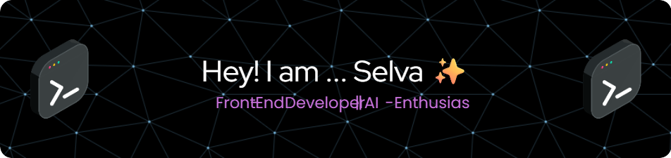

 

---

#  𝗜'𝗺 𝗦𝗲𝗹𝘃𝗮 ✨    

<table>
  <tr>
    <td style="vertical-align: top; width: 70%;">
      <h3>🎨 I’m a passionate <strong>Front-End Developer</strong></h3>
      
Focused on crafting beautiful, responsive, and user-friendly websites.

      <h3>🤖 Currently learning <strong>AI & ML</strong></h3>
      
Exploring Artificial Intelligence to enhance digital experiences.

      <h3>🌐 Open to <strong>collaborations</strong></h3>
      
Excited to work on Website Development and creative projects.

    </td>
    <td style="text-align: right; vertical-align: top;">
      
    </td>
  </tr>
</table>

---

<h2 align="left">🤝 Cᴏɴɴᴇᴄᴛ Wɪᴛʜ Mᴇ 🤝</h2>

  
  &nbsp;&nbsp;&nbsp;&nbsp;&nbsp;

  
  &nbsp;&nbsp;&nbsp;&nbsp;&nbsp;

  
  &nbsp;&nbsp;&nbsp;&nbsp;&nbsp;

  
  &nbsp;&nbsp;&nbsp;&nbsp;&nbsp;

  

✨ _Let’s connect and build something awesome together!_ ✨

---

### 🐍 GitHub Snake

  

---

<h2 align="center">Tᴇᴄʜ sᴛᴀᴄᴋ</h2> 
<picture>
  <source media="(prefers-color-scheme: dark)" srcset="./Skills_Animation_Dark.gif">
  <source media="(prefers-color-scheme: light)" srcset="./Skills_Animation_White.gif">
  
</picture>
 

<h3 align="left">💡 Skills & Current Learnings</h3>

<ul align="left">
  <li>🤖 <strong>Machine Learning & AI</strong> Core concepts, model training, and real-world applications.</li> 

  <li>⚛️ <strong>React.js</strong> Component architecture, advanced patterns, and state management (Redux, Context, Zustand).</li> 

  <li>☁️ <strong>Cloud Computing (AWS & Azure)</strong> Deployments, serverless functions, and storage solutions.</li> 

  <li>🧠 <strong>Deep Learning</strong> Model building using TensorFlow and PyTorch.</li> 

  <li>🛠️ <strong>DevOps</strong> Docker, Kubernetes, and CI/CD pipeline basics.</li>
</ul>

---
<h2 style="text-align: center;">⚒️ My Skills & Utilities</h2>

  <table style="width: 100%; max-width: 1000px; border-collapse: collapse; border: 2px solid #444; text-align: center;">
    <thead>
      <tr style="background-color: #f2f2f2;">
        <th style="border: 1px solid #ccc; padding: 10px;">🟦 Languages</th>
        <th style="border: 1px solid #ccc; padding: 10px;">🔧 Version Control</th>
        <th style="border: 1px solid #ccc; padding: 10px;">🎨 Design</th>
        <th style="border: 1px solid #ccc; padding: 10px;">💻 IDEs & Editors</th>
      </tr>
    </thead>
    <tbody>
      <tr>
        <td style="border: 1px solid #ccc; padding: 10px;">
          
          
          
          
          
        </td>
        <td style="border: 1px solid #ccc; padding: 10px;">
          
          
        </td>
        <td style="border: 1px solid #ccc; padding: 10px;">
          
          
        </td>
        <td style="border: 1px solid #ccc; padding: 10px;">
          
          
          
          
        </td>
      </tr>
      <tr style="background-color: #f2f2f2;">
        <th style="border: 1px solid #ccc; padding: 10px;">🤖 AI & Productivity</th>
        <th style="border: 1px solid #ccc; padding: 10px;">📝 Blogging & Community</th>
        <th style="border: 1px solid #ccc; padding: 10px;">⚙️ Frameworks & Backend</th>
        <th style="border: 1px solid #ccc; padding: 10px;">🧠 ML Platforms</th>
      </tr>
      <tr>
        <td style="border: 1px solid #ccc; padding: 10px;">
          
          
          
          
        </td>
        <td style="border: 1px solid #ccc; padding: 10px;">
          
          
        </td>
        <td style="border: 1px solid #ccc; padding: 10px;">
          
          
        </td>
        <td style="border: 1px solid #ccc; padding: 10px;">
          
          
          
          
        </td>
      </tr>
      <tr style="background-color: #f2f2f2;">
        <th colspan="4" style="border: 1px solid #ccc; padding: 12px; font-size: 18px;">🌐 Hosting & Deployment</th>
      </tr>
      <tr>
        <td colspan="4" style="border: 2px solid #444; padding: 14px; background-color: #fff;">
          
          
          
          
        </td>
      </tr>
    </tbody>
  </table>

---

### 📊 GitHub Stats

  <table>
    <tr>
      <td style="padding: 10px;">
        
      </td>
      <td style="padding: 10px;">
        
      </td>
    </tr>
  </table>

---

### 🔥 Contribution Streak

  

---

<!--Dynamic Quote card updates everyday at 12 PM--> 

  

<h2 align="left">🌟 Tʜᴏᴜɢʜᴛ ᴏғ ᴛʜᴇ Dᴀʏ 🌟</h2>

<!--STARTS_HERE_QUOTE_CARD-->

    

<!--ENDS_HERE_QUOTE_CARD-->

  

