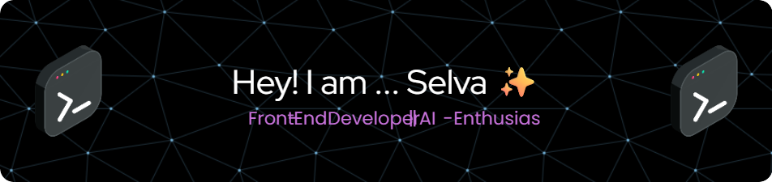

 

---

#  𝗜'𝗺 𝗦𝗲𝗹𝘃𝗮 ✨ 

<table>
  <tr>
    <td style="vertical-align: top; width: 70%;">
      <h3>🎨 I’m a passionate <strong>Front-End Developer</strong></h3>
      
Focused on crafting beautiful, responsive, and user-friendly websites.

      <h3>🤖 Currently learning <strong>AI & ML</strong></h3>
      
Exploring Artificial Intelligence to enhance digital experiences.

      <h3>🌐 Open to <strong>collaborations</strong></h3>
      
Excited to work on Website Development and creative projects.

    </td>
    <td style="text-align: right; vertical-align: top;">
       
    </td>
  </tr>
</table>

---

<h2 align="left">🤝 Cᴏɴɴᴇᴄᴛ Wɪᴛʜ Mᴇ 🤝</h2>

  
  &nbsp;&nbsp;&nbsp;&nbsp;&nbsp;

  
  &nbsp;&nbsp;&nbsp;&nbsp;&nbsp;

  
  &nbsp;&nbsp;&nbsp;&nbsp;&nbsp;

  
  &nbsp;&nbsp;&nbsp;&nbsp;&nbsp;

  

✨ _Let’s connect and build something awesome together!_ ✨

---

### 🐍 GitHub Snake

  

---

<h2 align="center">Tᴇᴄʜ sᴛᴀᴄᴋ</h2> 
<picture>
  <source media="(prefers-color-scheme: dark)" srcset="./Skills_Animation_Dark.gif">
  <source media="(prefers-color-scheme: light)" srcset="./Skills_Animation_White.gif">
  
</picture>
 

<h3 align="left">💡 Skills & Current Learnings</h3>

<ul align="left">
  <li>🤖 <strong>Machine Learning & AI</strong> Core concepts, model training, and real-world applications.</li> 

  <li>🔎 <strong>RAG</strong> Learning retrieval pipelines, embeddings, vector databases, and LLM integration using LangChain and Hugging Face.</li> 

  <li>☁️ <strong>Cloud Computing (Azure.OpenAI)</strong> Deployments, serverless functions, and storage solutions.</li> 

  <li>🧠 <strong>Deep Learning</strong> Model building using TensorFlow and PyTorch.</li> 

  <li>🛠️ <strong>DevOps</strong> Docker, Kubernetes, and CI/CD pipeline basics.</li>
</ul>

---
<h2 align="center">⚒️ My Skills & Utilities</h2>

<table align="center">
<tr>
<th width="25%" align="left">🟦 Languages</th>
<th width="25%" align="left">🔧 Version Control</th>
<th width="25%" align="left">🎨 Design</th>
<th width="25%" align="left">💻 IDEs & Editors</th>
</tr>

<tr>
<td align="left" valign="top">

</td>

<td align="left" valign="top">

</td>

<td align="left" valign="top">

</td>

<td align="left" valign="top">

</td>
</tr>

<tr>
<th align="left">🤖 AI & Productivity</th>
<th align="left">📝 Community</th>
<th align="left">⚙️ Frameworks & Backend</th>
<th align="left">🧠 ML Platforms</th>
</tr>

<tr>

<!-- AI -->
<td align="left" valign="top">

<!-- Dark icons -->

 

<!-- Light icons -->

</td>

<!-- Community -->
<td align="left" valign="top">

</td>

<!-- Backend -->
<td align="left" valign="top">

<!-- Dark -->

 

<!-- Flask -->

</td>

<!-- ML -->
<td align="left" valign="top">

</td>

</tr>

<tr>
<th colspan="4" align="center">
🌐 Hosting • Deployment • Automation
</th>
</tr>

<tr>
<td colspan="4" align="center">

</td>
</tr>

</table>
---

### 📊 GitHub Stats

  <table>
    <tr>
      <td>
        
      </td>
      <td>
        
      </td>
    </tr>
  </table>

---

### 🔥 Contribution Streak

---

<!--Dynamic Quote card updates everyday at 12 PM--> 

  

<h2 align="left">🌟 Tʜᴏᴜɢʜᴛ ᴏғ ᴛʜᴇ Dᴀʏ 🌟</h2>

<!--STARTS_HERE_QUOTE_CARD-->

    

<!--ENDS_HERE_QUOTE_CARD-->

  

