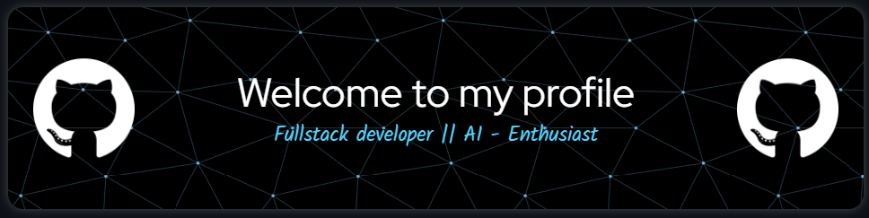

---

  

#  𝗜'𝗺 𝗦𝗲𝗹𝘃𝗮 ✨

🎨 I’m a passionate **Front-End Developer** focused on crafting beautiful, responsive, and user-friendly websites.  
🤖 Currently learning and exploring **Artificial Intelligence & Machine Learning** to enhance digital experiences.  
🌐 Open to **collaborations** on exciting **Website Development** and creative projects. 

---

<h2 align="left">🤝 Cᴏɴɴᴇᴄᴛ Wɪᴛʜ Mᴇ 🤝</h2>

  
  &nbsp;&nbsp;&nbsp;&nbsp;&nbsp;

  
  &nbsp;&nbsp;&nbsp;&nbsp;&nbsp;

  
  &nbsp;&nbsp;&nbsp;&nbsp;&nbsp;

  
  &nbsp;&nbsp;&nbsp;&nbsp;&nbsp;

  

✨ _Let’s connect and build something awesome together!_ ✨

---

### 🐍 GitHub Snake

  

---

<h2 align="center">Tᴇᴄʜ sᴛᴀᴄᴋ</h2> 
<picture>
  <source media="(prefers-color-scheme: dark)" srcset="./Skills_Animation_Dark.gif">
  <source media="(prefers-color-scheme: light)" srcset="./Skills_Animation_White.gif">
  
</picture>
 

<h3 align="left">💡 Skills & Current Learnings</h3>

<ul align="left">
  <li>🤖 <strong>Machine Learning & AI</strong> Core concepts, model training, and real-world applications.</li> 

  <li>⚛️ <strong>React.js</strong> Component architecture, advanced patterns, and state management (Redux, Context, Zustand).</li> 

  <li>☁️ <strong>Cloud Computing (AWS & Azure)</strong> Deployments, serverless functions, and storage solutions.</li> 

  <li>🧠 <strong>Deep Learning</strong> Model building using TensorFlow and PyTorch.</li> 

  <li>🛠️ <strong>DevOps</strong> Docker, Kubernetes, and CI/CD pipeline basics.</li>
</ul>

---
<h2>⚒️ My Skills & Utilities</h2>

<table style="width:100%; border-collapse: collapse;">
  <tr>
    <th>🟦 Languages</th>
    <th>🔧 Version Control</th>
    <th>🎨 Design</th>
    <th>💻 IDEs & Editors</th>
  </tr>
  <tr>
    <td>
      
      
      
      
      
    </td>
    <td>
      
      
    </td>
    <td>
      
      
    </td>
    <td>
      
      
      
      
    </td>
  </tr>

  <tr>
    <th>🤖 AI & Productivity</th>
    <th>📝 Blogging & Community</th>
    <th>⚙️ Frameworks & Backend</th>
    <th>🧠 ML Platforms</th>
  </tr>
  <tr>
    <td>
      
      
      
      
    </td>
    <td>
      
    </td>
    <td>
      
      
    </td>
    <td>
      
      
      
      
    </td>
  </tr>

  <tr>
    <th colspan="4">🌐 Hosting & Deployment</th>
  </tr>
  <tr>
    <td colspan="4" style="text-align:center;">
      
      
      
      
    </td>
  </tr>
</table>
---

### 📊 GitHub Stats

  <table>
    <tr>
      <td style="padding: 10px;">
        
      </td>
      <td style="padding: 10px;">
        
      </td>
    </tr>
  </table>

---

### 🔥 Contribution Streak

  

---

<!--Dynamic Quote card updates everyday at 12 PM--> 
<h2 align="left">🌟 Tʜᴏᴜɢʜᴛ ᴏғ ᴛʜᴇ Dᴀʏ 🌟</h2>

<!--STARTS_HERE_QUOTE_CARD-->

    

<!--ENDS_HERE_QUOTE_CARD-->

  

